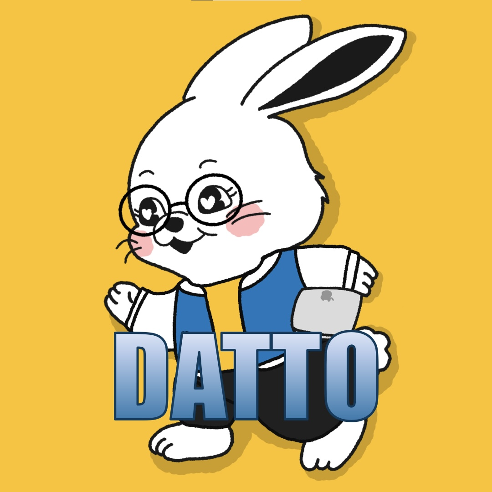

#  So, Say it DATTO!

## Q. DATTO는 어떤 조직인가요?
> A. 경북대학교 해달 동아리의 트랙 중 하나로, 데이터 분야에 관심이 있는 사람끼리 모여 학습을 진행하고, 인사이트를 공유하는 모임입니다. 주로 <ins>**데이터 분석**</ins>과 <ins>**인공지능**</ins>과 관련하여 <ins>**개인별 학습 목표를 설정하고, 목표를 달성**</ins>하기 위해, <ins>**지속적인 자율 공부**</ins>를 독려하며, <ins>**그룹 활동**</ins>과 <ins>**발표 세션**</ins>을 통해 자유로운 <ins>**인사이트 공유**</ins>를 지향하고 있으며, 서로의 성장을 격려하는 활동을 하고 있습니다!

## Q. DATTO에서 어떤 활동을 하고 있나요?
> A. 크게 "**4가지 + @**" 활동을 하고 있습니다. 첫 번째는 <ins>**데이토 전체 모임**</ins>이 있고, 두 번째는 <ins>**퍼스널 러닝**</ins>(개인 학습), 세 번째는 <ins>**그룹 러닝**</ins>(인사이트 공유), 마지막으로 <ins>**매주 발표 세션**</ins>이 있습니다! 그 외에도 프로젝트 or 공모전 활동을 하고 있습니다!

## Q. 데이토 전체 모임에서 무엇을 하나요?
> A. 데이토 전체 모임은 활동 초기에 <ins>**OT**</ins>를 포함하여 <ins>**리부팅 모임**</ins>, <ins>**완주 모임**</ins>으로 이루어져 있습니다. <ins>**데이토 OT**</ins>에서는 트랙원 간의 아이스브레이킹 및 한 학기 동안 전반적인 활동 일정과 진행하는 활동에 대해 소개하는 시간을 가지며, 학기 중간에 <ins>**리부팅 모임**</ins>을 통해 개인별 학습 목적과 목표를 점검하는 시간을 가집니다. 학기 끝 무렵에 <ins>**완주 모임**</ins>을 가지며 여기서 개인별로 얼마나 열심히 활동을 했고, 목표를 이루었는지 확인하면서 서로 격려(회식)하는 시간을 가집니다!

## Q. 퍼스널 러닝이 무엇인가요?
> A. 데이토 활동 초기에 개인별 학습 목적과 목표를 정하고, 매주 자신이 학습할 범위를 계획하여 자율적으로 학습하는 활동입니다. 퍼스널 러닝을 진행하면서 알게된 사실이나 지식을 노션의 개인 페이지에 기록하여 추후 그룹 러닝이나 발표 활동에서 인사이트를 공유할 때 활용할 수 있습니다.

## Q. 그룹 러닝이 무엇인가요?
> A. 격주로 진행하는 스터디 활동으로, 퍼스널 러닝으로 정리한 지식, 그 중에서 깨달은 지식이나 새롭게 알게된 점을 토대로 같은 그룹원과 모여 서로의 인사이트를 공유하는 활동입니다. 서로 정리한 내용을 바탕으로 문답 활동을 하면서 지식을 확장시키는 것을 목표로 하고 있습니다.

## Q. 발표 세션은 무엇인가요?
> A. 매주 정기적으로 해당 주차의 발표자가 데이터와 관련된 자율 주제를 정하거나 새로운 소식, 트렌드에 대한 발표 자료를 제작하여 발표하는 활동입니다. 또, 학기 중에 모든 트랙원이 최소 1번은 발표할 수 있도록 일정을 계획하고 있습니다.

## Q. 프로젝트나 공모전에도 나가나요?
> A. 프로젝트나 공모전을 나가고 싶은 개인이 톡방이나 DATTO 디스코드 채널을 통해 팀원 모집 공지를 업로드 하면, 해당 공지를 바탕으로 팀을 꾸려 프로젝트를 진행하거나 공모전에 참여할 수 있도록 하고 있습니다. 또한, 트랙장에게 필요한 자원을 요청하면, 해당 요청을 고려하여 동아리 운영진 측과 협의 후 최대한 지원할 수 있도록 도움을 주고 있으니 부담없이 활발하게 활동해주시면 됩니다!

## Q. 데이토에서는 어떤 사람을 모집하나요?
> A. 데이터 분야(데이터 사이언스, 엔지니어링, 인공지능 등)에 관심 있는 누구든지 모집하고 있습니다. 개인적으로 공부를 하고 싶으나 학습 범위가 넓어 공부하기 막막한 분, Python 언어에 대한 이해도가 있으나 무슨 공부를 해야 할지 모르겠는 분이시면 언제든지 참여하실 수 있습니다. 그리고 신규 멤버의 경우 대면으로 데이토 OT 참석이 가능한 사람을 우선적으로 모집하고 있습니다!

## DATTO 모집 공고 & 운영 방침 👇
[⚖️ 운영 방침 확인하러 가기](https://knu-haedal.notion.site/2026-1-DATTO-310837fdd1cb80f28e21fec1f2a6ff0d?pvs=143)

[📰 2026년도 1학기 DATTO 모집 공고](https://knu-haedal.notion.site/2026-1-DATTO-310837fdd1cb801aa9a1f49c3f08a2bf?pvs=143)

## 👨‍👩‍👧‍👦 현 DATTO 운영진
|Name|Github|Email|Position|
|:---|:---|:---|:---|
|허진수|[HJTN](https://github.com/HJTN)|zintnm21@gmail.com|👑 트랙장|
|배영랑|||📖 DATTO 아카데미 대표 러닝 리더|
|김재원|||미정|
|박지인|[pjiin22](https://github.com/pjiin22)|kelly6161@naver.com|미정|

## 🏆 DATTO 명예 전당
> ### Q. 🤔 명예의 전당에는 어떤 사람이 올라오나요?
> A. DATTO의 발전에 기여한 분들과 학기 중 DATTO 활동에 활발하게 참여한 사람을 위주로 뽑아서 올려드리고 있습니다! 특히 매주 목표 학습 시간을 지속적(3번 이상)으로 달성하신 분을 우선적으로 올려드립니다!

### 🌟 역대 트랙장
|Name|Github|Email|
|:---|:---|:---|
|1 ~ 2기 배영랑|||
|3 ~ 4기 허진수|[HJTN](https://github.com/HJTN)|zintnm21@gmail.com|

### 🎖️ DATTO 운영 기여자
|Name|Github|Email|
|:---|:---|:---|
||||

### 🐉🥇 DATTO 우수자 참여자
|Name|Github|Email|
|:---|:---|:---|
||||
